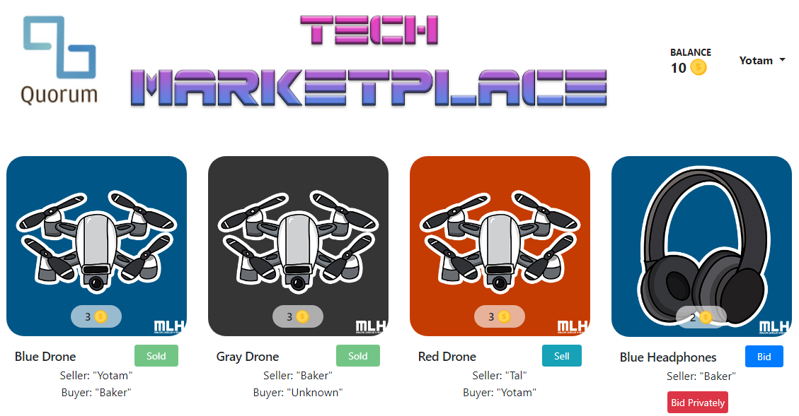

# TechMarketplace: A Sample App Utilizing Quorum


TechMarketplace is an example application running on top of a Quorum network which allows users to bid for and offer virtual hackathon gear for sale in an interactive marketplace. This app is based on what was originally developed for the MLH Localhost Quorum workshop, which demonstrates how to run a simple Ethereum application and how to write a simple Smart Contract that interacts with the Ethereum-based network. The original app can be found [here](https://github.com/MLH/mlh-localhost-tech-marketplace).

## Goals 

Produce an example which will demonstrate some of the various advantages and challenges Quorum brings to the table, while still having a simple enough flow to understand. The example should also highlight the private state / public state usage and design implications in a practical use case, as a marketplace. 
 
## Design & Flow
This design introduces these key changes:
-	All items are owned by an account.
-	A sale is between two accounts, and is reflected in their respective balances.
-	A buyer can purchase an item privately and “publicly” (privately inclusive) from seller. When Item is sold privately, other marketplace participants will know the item was sold, but will not know who was the buyer (appears as Buyer: “Unknown” in the UI). 
-	In order to accomplish it, the seller will update “publicly” the item state to sold, which in it’s turn will envoke an event notifiying all participants on the sale. 
-	TechToken: ERC20 standard implementation, used as marketplace cash token. To create a bid, an account needs to approve funds for Market which will use them to execute sale. 
-	Bidding mechanism, operated by BidManager, which enforces the use of a single bid for an item, and discards the unseccessful bids. 
-	Bank node, which owns the TechToken and provides funds for accounts and is privy to all txns. 

The implementation of reselling an item that was purchased via private txns presented a challenge, and several approaches were considered.
Possible approaches:
1.	Let anyone reoffer Item for sale. 
Issue: doesn't reflect the ownership of item. Relies on the app level to enforce ownership.
2.	Create new item with same properties (newId) and put up for sale. 
Issue: similar to before, but actually quite realistic as it's similar to existing marketplace models today. Also, will not affect purchased item ownership.
3.	During sale, generate Random string that only seller will have, and store it's hash on the item. After the sale is complete, seller will transfer the string off-chain to buyer, which will use it to put the item back on sale. Issue: relies on seller to provide string off-chain (not enforceable on chain), but also realistic. More complicated mechanism.
4.	When buyer wishes to remove their anonymity and resell item, they will ask the original seller to change “publicly” the ownership on the item.
Issue: similar to before, but realistic and less complicated.

Eventually, approach 4 was selected and implemented.

## Requirements
### Quorum
This app uses Quorum as the Ethereum protocol in this project. It can be run on top of Quorum's [7nodes](https://github.com/jpmorganchase/quorum-examples/tree/master/examples/7nodes) example that runs several Quorum nodes in parallel using a virtual machine.
Please follow the steps mentioned in the [7 nodes repo](https://github.com/jpmorganchase/quorum-examples/tree/master/examples/7nodes) & the wider [quorum-examples repo](https://github.com/jpmorganchase/quorum-examples) to setup & run the local Quorum network **with these modification**:
1. Adding to PRIVATE_CONFIG the parameter **--rpccorsdomain "http://localhost:3000"**, in raft-start.sh / instanbul-start.sh / docker-compose.yml, depending on usage.
2. Reduce the number of nodes to 4 by following steps 1,2 [here](https://github.com/jpmorganchase/quorum-examples/tree/master/examples/7nodes#reducing-the-number-of-nodes).


### App
* Install [NodeJS](https://nodejs.org) - Event-driven Javascript runtime environment
* Install [NPM](https://www.npmjs.com/) - Popular package manager for JavaScript
* Install [Truffle](http://truffleframework.com/) - Development framework for Ethereum applications (This app was last tested on Truffle 4.1.15 with Solidity v0.4.25)


## Installation

```sh
$ git clone https://github.com/lyotam/TechMarketplace.git
$ cd TechMarketplace
$ npm install
```

## Running

To get your TechMarketplace application up and running locally, you will need to run the Quorum network, compile your contracts, migrate those contracts to the network, populate those contracts with data, then run your application:

### Quorum network
To setup & run the Quorum network, follow the steps [here](https://github.com/jpmorganchase/quorum-examples#getting-started).

### TechMarketplace

```sh
$ truffle compile
$ truffle migrate --reset
$ npm run seed
$ npm start
```


## Additional Resources

* [Web3JS documentation](https://github.com/ethereum/wiki/wiki/JavaScript-API) - Documentation for web3.js, an API for interacting with Ethereum network
* [Solidity documentation](https://solidity.readthedocs.io) - Documentation for writing Smart Contracts for the Ethereum Virtual machine
* [Truffle documentaion](http://truffleframework.com/docs/) - Documentation for building Ethereum apps using the Truffle framework
* [Ethereum Pet Shop](http://truffleframework.com/tutorials/pet-shop) - A tutorial developed by the Truffle team to write your first Ethereum application

## License

Unless otherwise stated, the code in this repo is released under the MIT
License.

```
Copyright (c) 2018 Major League Hacking, Inc.

Permission is hereby granted, free of charge, to any person obtaining a copy
of this software and associated documentation files (the "Software"), to deal
in the Software without restriction, including without limitation the rights
to use, copy, modify, merge, publish, distribute, sublicense, and/or sell
copies of the Software, and to permit persons to whom the Software is
furnished to do so, subject to the following conditions:

The above copyright notice and this permission notice shall be included in all
copies or substantial portions of the Software.

THE SOFTWARE IS PROVIDED "AS IS", WITHOUT WARRANTY OF ANY KIND, EXPRESS OR
IMPLIED, INCLUDING BUT NOT LIMITED TO THE WARRANTIES OF MERCHANTABILITY,
FITNESS FOR A PARTICULAR PURPOSE AND NONINFRINGEMENT. IN NO EVENT SHALL THE
AUTHORS OR COPYRIGHT HOLDERS BE LIABLE FOR ANY CLAIM, DAMAGES OR OTHER
LIABILITY, WHETHER IN AN ACTION OF CONTRACT, TORT OR OTHERWISE, ARISING FROM,
OUT OF OR IN CONNECTION WITH THE SOFTWARE OR THE USE OR OTHER DEALINGS IN THE
SOFTWARE
```
